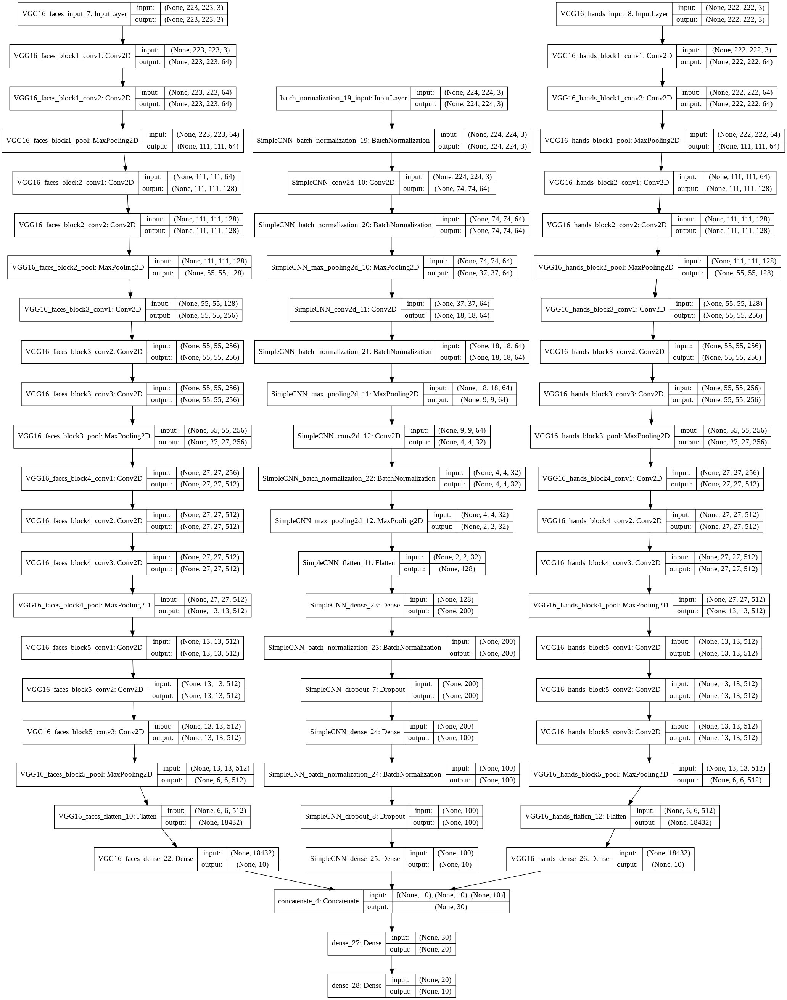
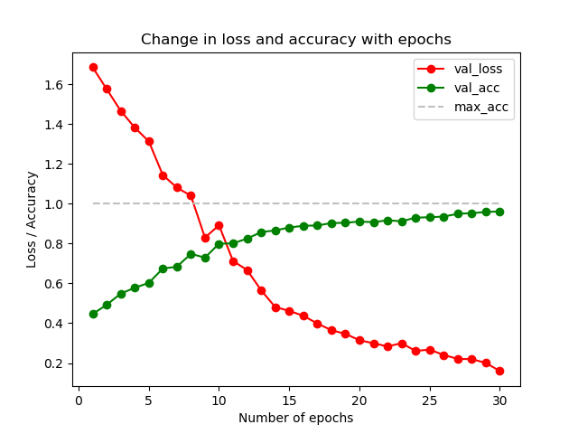
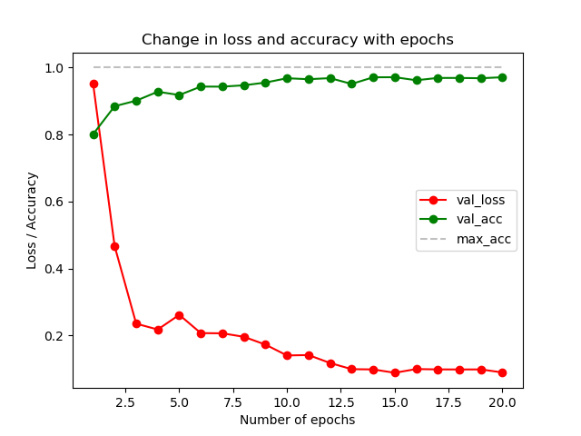

# Distracted Driver Detection
Classifying dashcam images to detect cases of distracted and safe driving.

# Environment
The library dependencies can be found in `requirements.txt`. All packages can be installed using `pip install <package_name>`. I have used Keras with the TensorFlow backend, and Arun Ponnusamy's repository `cvlib` which is available [here](https://github.com/arunponnusamy/cvlib).

# Files
There are 4 files - `distracted_driver_detection.py`(main file); `models.py`, which contains all the deep learning model definitions; `generators_and_training.py`, which contains all the data generators and training functions; and finally `data_utilities.py`, which contains several utility functions mostly dealing with file operations.

# Background and Data
Distracted drivers are a prime cause of road accidents. Using cellphones while driving is fairly commonplace, whether it be to change the music, texting, speaking on the phone or taking videos. Identifying and preventing cases of distracted driving is an important task, the National Safety Council claims that 1 of every 4 car accidents in the United States is caused by a driver who is not paying attention to the road. State Farm hosted a challenge on Kaggle to identify cases of distracted driving using computer vision. This is my implementation for that challenge. The Kaggle challenge can be found [here](https://www.kaggle.com/c/state-farm-distracted-driver-detection).

The dataset is provided by State Farm and is available on Kaggle. It has around 16,000 training images and 79,000 testing images. The training images belong to 10 classes -
-  c0: Safe driving
-  c1: Texting (right)
-  c2: Talking (left)
-  c3: Texting (left)
-  c4: Talking (left)
-  c5: Operating the radio.
-  c6: Drinking / eating.
-  c7: Reaching behind.
-  c8: Hair and make-up.
- c9: Talking to the passenger.
The training images are split into ten directories each containing images belonging to one of the classes. Note that none of the people in the training images show up again in the testing images or vice versa. This, and a larger testset than trainset make the competition challenging. 

My focus is on the use of different techniques and seeing how different implementations compare to eachother.

# Implementation Details
I have used several techniques in the project. The models include a shallow ConvNet architecture, VGG16, ResNet50, InceptionV3 and Xception. I also used an ensemble model by combining different models. Finally, I used pseudo-labelling to generate new labeled data from the test images. You can find more information about pseudo-labeling [in this paper](http://deeplearning.net/wp-content/uploads/2013/03/pseudo_label_final.pdf) which proposed the technique and has a decent number of citations.

Before you running the program, there are some plugs that need to be set at the beginning of the main function in `distracted_driver_detection.py`. To correctly set these plugs some information about the implementation and the flow of the repository follows. The first three points are for data preprocessing, step 4 and 5 are for single models and the remaining steps are for the model ensembles. 
1. Split the training data into three sets. Each set consists of the training and validation sets.
2. Further split the training and validation sets into a _main_ set (to use for training) and a _mini_ set (to use while deciding the hyperparameters i.e. babysitting the learning process).
3. Generate new data from the training and validation sets by cropping the hands and faces of the drivers. The motivation behind this is that observing the hands would likely help detect some of the classes (think: operating the radio, reaching behind, hair and make-up, texting). On the other hand, observing the face would help detect some other classes (think: talking on the phone, talking to the passenger). These new datasets (hands and faces) also have _main_- and _mini_-sets. Faces are extracted using the `detect_faces()` function in `cvlib` and the hands are extracted by simply cropping a mid-portion of each image.
4. Run the single models (ConvNet and VGG16) individually on each of the image trainsets (full images, hand crops, face crops). In the beginning, it is advisable the _mini_-sets and find the best values for the hyperparameters. One method is to start with a broad range of values for each hyperparameter, and then narrow down to a smaller range that works. Once you have your small range, training on the _main_-set will be much easier and time efficient.
5. At this stage there should be six model weight files - 3 for the ConvNet and 3 for VGG16. 
6. Next, the ensemble model is trained using the best weight files from the previous stage. The ensemble model has three input arms - one arm trained on the full crops, one trained on the hands and one trained on the faces. The predictions from each arm are consolidated and presented as a single probability distribution. This consolidation is done by a neural network, which must be trained. In this stage, the neural net learns the importance of each arm and the final prediction is a function of predictions from each arm.

7. [Optional] The ensemble should be trained using images that its components haven't seen before. I used the _mini_-sets to train the ensemble but since it has very few images, pseudo-labelling is a good solution.
8. [Optional] I used the ensemble (trained on mini-sets) to make predictions on a portion of the testing images - this is called pseudo-labelling. I then used these new labeled images to train my ensemble further and make predictions on the rest of the test dataset.

# Results and Notes
While training the single models (step 4), I trained ResNet50, Inceptionv3 and Xception in addition to the simple ConvNet and VGG16. These deeper models did not do very well however and I decided to discard their results. All models apart from the simple ConvNet were transfer learned from the Imagenet weight files.

After training I found that VGG16 was much more confident and accurate than the simple ConvNet, despite similar accuracy (see Plots 1 and 2). Finally, my ensemble showed better performance with three VGG16 arms - resulting in better pseudo-labels and consequently better final results. Note that you can use the main-sets to train the ensemble in step 7. Since the component models are frozen anyway, it may not matter much. In that case, there is no need for pseudo-labeling.

